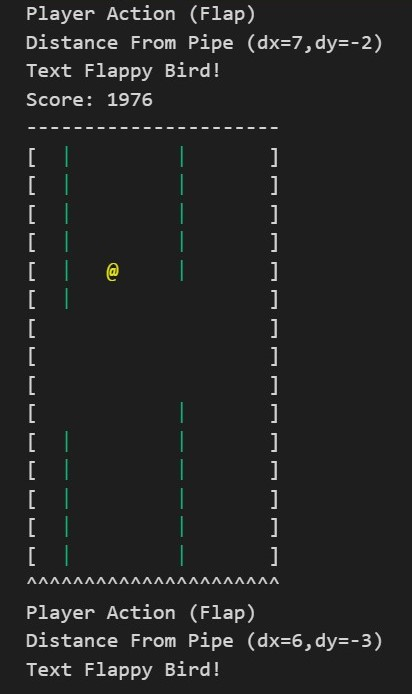
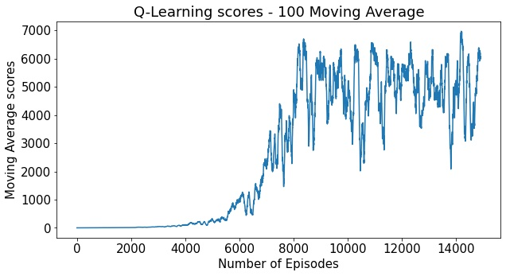
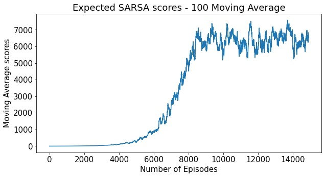

# Flappy Bird RL
An implementation of the famous game "Flappy Bird" using Reinforcement Learning algorithms

## Project Content
1 - Selection and Implementation of two off-policy agents: A Q-Learning and Expected SARSA agent have been implemented and tested in a text verison environment of Flappy Bird. Both agents were given an epislon-decaying functionality when selecting an action in the espilon-greedy context.

2 - Hyperparameter Sweep: Finding the optimal step size and epsilon start that yield the greatest rewards for each agent.

3 - Model Comparison: Comparing the value functions, policies, convergence time, and scoring capabilities of both agents.

4 - Game Simulation: A similation of the agents in the game environment to assess their max score abilities

## Results and Dicussion

Both agents performaned considerably and well able to exceed a score of 1000 in the game (in reality trained in a max score of 7000 setting). The expected SARSA agent showed less variance in scoring abilities at convergence (see below). Detailed comparisons can be found in the attached notebook and report.

